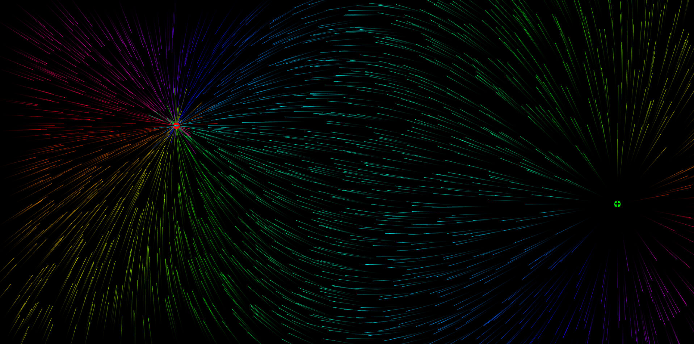

# Eletric Fields

simulates an eletric field with negative and positive charges that circle around the window.  
  
## Controls:
| Instruction | Key |
|-------------|-----|
| Add positive charge |<kbd>Left click</kbd>|
| Add negative charge |<kbd>Shift + Left click</kbd>|
| Hide charges | <kbd>Space</kbd>|

## Running
You can clone it, or just try it [here](https://maria-contins.github.io/EletricFields/)!

## Made with
* [**Cláudio Guerra**](https://github.com/claudiofcguerra)
